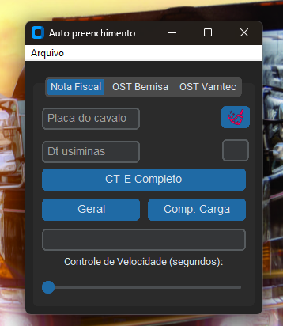
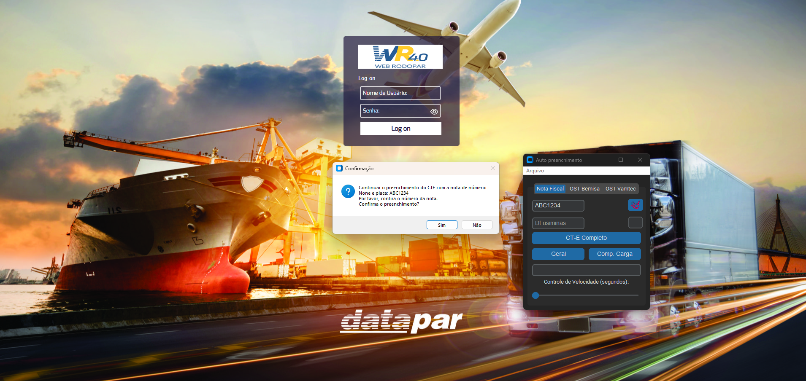

# CTE Automation
### Clean public version republished for demonstration purposes only; the original version is private, with releases and updates continuing through April 2026.
### Versão pública republicada e limpa apenas para demonstração, a versão original se encontrada privada com release e atualizações até Abril de 2026

---
This was my first project addressing a real-world problem; the app was used by over eight employees at Fertran and became critical to their workflow, as it handled the core tasks of the administrative assistants. The Fertran branch where I worked managed short-haul waste transport operations that generated around 300 loading invoices daily; the app enabled the staff to eliminate this daily workload, freeing up time to focus on operational improvements.🚀

Esté foi meu primeiro estudo e desenvolvimento em área em um problema real, o app foi usado por mais de 8 colaboradores na empresa Fertran causando uma grande dependencia pois lidava com a atividade central dos auxiliares administrativos a Filial da Fertran onde trabalhei tinham fluxos curtos de transporte de residuos o que gerava em torno de 300 notas fiscais de carregamentos diariamente, com esse app os colaboradores conseguiram eliminar as demandas diariamente tendo tempo livre para focar nas melhorias da operação.🚀

---


A desktop application that assists the creation of electronic transport documents from invoice XML files. The public version uses fictional companies, identifiers, routes, products, and business rules.

Uma aplicação desktop que auxilia na criação de documentos eletrônicos de transporte a partir de arquivos XML de notas fiscais. A versão pública utiliza empresas, identificadores, rotas, produtos e regras de negócio fictícios.

## The problem / O problema

Before the automation, the workflow depended on several manual steps. An operator had to wait for the driver to send a photo of the invoice, print a copy because printing was part of the company's procedure, and manually enter the relevant data into the company's remote logistics ERP.

Antes da automação, o fluxo dependia de várias etapas manuais. O colaborador precisava aguardar o motorista enviar uma foto da nota fiscal, imprimir uma cópia porque a impressão fazia parte do procedimento da empresa e digitar manualmente os dados relevantes no ERP remoto de logística.

This process was slow and error-prone. The operator had to enter many numbers by hand, including the invoice access key, which contains 44 digits. A single typing mistake, or selecting the wrong field in the remote system, could compromise the document and require rework.

Esse processo era lento e sujeito a erros. O colaborador precisava digitar muitos números manualmente, incluindo a chave de acesso da nota fiscal, que possui 44 dígitos. Um único erro de digitação ou a seleção do campo errado no sistema remoto podia comprometer o documento e gerar retrabalho.

The workflow also depended on the quality of the photo sent by the driver. Even when the information was correct, the operator still had to read the document, find the XML through the appropriate channel, print the invoice, and repeat the same data-entry process for every document.

O fluxo também dependia da qualidade da foto enviada pelo motorista. Mesmo quando as informações estavam corretas, o colaborador ainda precisava interpretar o documento, localizar o XML pelo canal adequado, imprimir a nota e repetir o mesmo processo de digitação para cada documento.

## What I built / O que foi desenvolvido

After analyzing the bottlenecks, I developed a small Python desktop application with a graphical interface. The operator enters the vehicle plate associated with the transport document and obtains the invoice XML through the available company workflow, such as the government portal or email.

Depois de analisar os gargalos, desenvolvi uma pequena aplicação desktop em Python com interface gráfica. O colaborador informa a placa do veículo vinculada ao documento de transporte e obtém o XML da nota fiscal pelo fluxo disponível na empresa, como o portal da Receita ou o e-mail.

The application reads the XML, extracts the relevant fields, applies the configured business rules, and fills the remote ERP. Because the ERP did not expose a suitable integration API, the application interacts with its interface using screen-detection anchors and simulated keyboard and mouse actions.

A aplicação lê o XML, extrai os campos relevantes, aplica as regras de negócio configuradas e preenche o ERP remoto. Como o ERP não disponibilizava uma API de integração adequada, a aplicação interage com a interface por meio de âncoras de detecção de tela e ações simuladas de teclado e mouse.

The operator remains responsible for the final review. The goal was not to remove human validation, but to remove repetitive transcription and reduce the number of decisions and keystrokes required during the process.

O colaborador continua responsável pela validação final. O objetivo não era remover a conferência humana, mas eliminar a transcrição repetitiva e reduzir a quantidade de decisões e teclas necessárias durante o processo.

## Results / Resultados

The total time required to prepare one document dropped from approximately 10 minutes to less than 2 minutes, including both the automated steps and the manual final validation that was still required from the operator.

O tempo total para preparar um documento caiu de aproximadamente 10 minutos para menos de 2 minutos, considerando tanto as etapas automatizadas quanto a validação final manual que ainda era necessária ao colaborador.

The automation also removed the printing requirement from the operational flow and reduced the risk of errors caused by typing long numeric values or selecting the wrong field in the remote ERP.

A automação também eliminou a necessidade de impressão dentro do fluxo operacional e reduziu o risco de erros causados pela digitação de números extensos ou pela seleção do campo incorreto no ERP remoto.

The result was a shorter and more consistent workflow. The application did not replace the operator; it gave the operator a faster and safer way to complete the repetitive part of the job.

O resultado foi um fluxo mais rápido e consistente. A aplicação não substituiu o colaborador; ela forneceu uma forma mais rápida e segura de executar a parte repetitiva do trabalho.

## Interface / Interface






## Main capabilities / Principais capacidades

- XML parsing and extraction of invoice data
  Leitura e extração de dados do XML da nota fiscal
- PDF processing and file monitoring
  Processamento de PDF e monitoramento de arquivos
- OCR support for scanned documents
  Suporte a OCR para documentos digitalizados
- Automatic file identification and renaming
  Identificação e renomeação automática de arquivos
- Configurable business rules stored in JSON
  Regras de negócio configuráveis armazenadas em JSON
- Screen detection using image anchors
  Detecção de tela usando âncoras de imagem
- Simulated keyboard and mouse interaction
  Interação simulada de teclado e mouse
- Desktop operator interface
  Interface desktop para o operador
- Final workflow validation
  Validação final do fluxo

## How the workflow works / Como o fluxo funciona

1. The operator enters the vehicle plate and the document information.
   O colaborador informa a placa do veículo e os dados do documento.
2. The invoice XML is obtained through the available workflow.
   O XML da nota fiscal é obtido pelo fluxo disponível.
3. The application parses the XML and extracts the required fields.
   A aplicação interpreta o XML e extrai os campos necessários.
4. Business rules determine how each field should be filled.
   As regras de negócio determinam como cada campo deve ser preenchido.
5. Screen anchors locate the corresponding controls in the remote ERP.
   As âncoras de tela localizam os controles correspondentes no ERP remoto.
6. The application fills the form using simulated keyboard and mouse actions.
   A aplicação preenche o formulário usando ações simuladas de teclado e mouse.
7. The operator reviews the result and completes the final step.
   O colaborador confere o resultado e conclui a etapa final.

## Technology stack / Stack tecnológico

| Area / Área | Technology / Tecnologia |
|---|---|
| Desktop interface / Interface desktop | CustomTkinter, tkinter |
| Screen automation / Automação de tela | PyAutoGUI |
| Image matching / Detecção de imagem | OpenCV, Pillow |
| XML parsing / Leitura de XML | xml.etree.ElementTree |
| PDF processing / Processamento de PDF | pdfplumber, PDFMiner.six |
| File monitoring / Monitoramento de arquivos | watchdog |
| Text-to-speech / Síntese de voz | pyttsx3 |
| Windows integration / Integração com Windows | pywin32 |
| Packaging / Empacotamento | PyInstaller |

## Project structure / Estrutura do projeto

```text
CTE_Automation/
├── main.py                    # Main desktop interface / Interface desktop principal
├── utils.py                   # Shared automation utilities / Utilitários compartilhados
├── pdf_monitor.py             # PDF monitoring thread / Monitoramento de PDFs
├── version_checker.py         # Release update checker / Verificador de atualizações
├── xml_process/               # XML parsing and document workflows / Processamento do XML
├── ost_dadosfixos/            # Demo terminal workflows / Fluxos de terminais fictícios
├── config/                    # Mock business rules / Regras de negócio fictícias
└── imagens/                   # Screen-detection templates / Templates de detecção de tela
```

## Important note / Observação importante

This repository is a sanitized public demonstration. The original operational data was replaced with mock values before publication. The JSON files are kept to demonstrate the configuration-driven design, but they do not represent real customers, routes, tax identifiers, or production rules.

Este repositório é uma demonstração pública sanitizada. Os dados operacionais originais foram substituídos por valores fictícios antes da publicação. Os arquivos JSON foram mantidos para demonstrar o design orientado a configuração, mas não representam clientes, rotas, identificadores fiscais ou regras de produção reais.

The application was designed for a Windows environment and for a specific remote ERP interface. Running it against a different system requires new screen anchors, validation, and workflow configuration.

A aplicação foi projetada para um ambiente Windows e para uma interface específica de ERP remoto. Executá-la em outro sistema exige novos templates de tela, validação e configuração do fluxo.

## Status / Status

This is a public portfolio version of an automation project originally built to solve a real operational problem. The repository focuses on the architecture and engineering decisions behind the solution; the production environment and original business data are not included.

Esta é uma versão pública de portfólio de um projeto de automação originalmente criado para resolver um problema operacional real. O repositório foca a arquitetura e as decisões de engenharia da solução; o ambiente de produção e os dados originais da empresa não estão incluídos.
